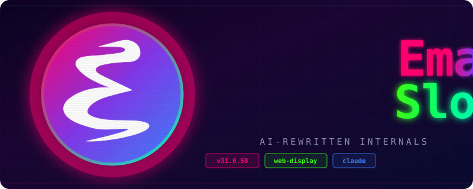

<p align="center">
  
</p>

<p align="center">
  <strong>GNU Emacs but the internals got rewritten by Claude and Codex</strong>
</p>

<p align="center">
  <a href="#web-display-backend">Web Display</a> &bull;
  <a href="#building">Building</a> &bull;
  <a href="#architecture">Architecture</a> &bull;
  <a href="#whats-changed">What's Changed</a>
</p>

---

This is a fork of GNU Emacs 31.0.50 where major parts of the C internals have been rewritten using AI (Claude, Codex). The headline feature is a **web display backend** that lets you run Emacs in a browser over WebSocket.

Not a wrapper. Not a terminal emulator. The actual Emacs redisplay engine talks to a browser canvas.

## What's Changed

The following components were written/rewritten with AI assistance:

| Component | Files | What |
|-----------|-------|------|
| **Web terminal backend** | `src/webterm.c`, `src/webterm.h` | Full display backend (~2900 lines of C) — frame creation, glyph rendering hooks, flush, event dispatch |
| **Async I/O event loop** | `src/web_event_loop.c/.h` | Pthread-based async I/O — polls proxy fd + wake pipe, parses NDJSON events, notifies main thread |
| **WebSocket proxy** | `web-display/main.c` | C proxy process — bridges Unix socketpair (NDJSON) to WebSocket (JSON) using kqueue/epoll |
| **Browser client** | `web-client/src/` | React/Vite app — canvas glyph-atlas renderer, input handling, debug REPL |
| **Font backend** | `src/webfont.c` | Monospace font metrics for web display |
| **Lisp primitives** | `src/webfns.c` | Web-specific Emacs Lisp functions |
| **Terminal init** | `lisp/term/web-win.el` | Lisp-side initialization for web frames |
| **Core integrations** | `src/keyboard.c`, `src/eval.c`, `src/frame.c`, etc. | Hooks into command loop, redisplay, frame management |

## Web Display Backend

```
  Browser (React/Canvas)
        |
    WebSocket
        |
  Proxy (C, kqueue/epoll)
        |
  Unix socketpair + NDJSON
        |
  Emacs (C, pthread I/O)
```

**Three-tier architecture:** Emacs spawns a C proxy process connected via socketpair. The proxy speaks WebSocket to the browser. A dedicated I/O thread in Emacs handles async communication so the main Emacs event loop never blocks on network I/O.

### Performance

| Metric | Value |
|--------|-------|
| CPU at idle | 0% |
| Memory | ~190 MB |
| Key-to-display latency | 2 ms |
| Typing throughput | 40 fps @ 33 chars/sec |

## Building

```bash
# Configure with web display support
./configure --with-web

# Build Emacs
make -j$(nproc)

# Build the WebSocket proxy
cd web-display && make clean && make && cd ..

# Install browser client deps
cd web-client && npm install && cd ..

# Run
./src/emacs
# Open http://localhost:8080 in your browser
```

### Requirements

- C compiler with pthread support
- Node.js (for the browser client)
- A browser with canvas support (all of them)

## Architecture

See [ARCHITECTURE-plan.md](ARCHITECTURE-plan.md) and [WEB-DISPLAY-ARCHITECTURE.md](WEB-DISPLAY-ARCHITECTURE.md) for the full design docs.

### Event Flow

1. Browser keypress -> WebSocket -> proxy -> socketpair -> I/O thread
2. I/O thread parses event -> pushes to queue -> writes to notify pipe
3. Main thread wakes on notify pipe -> `web_read_socket()` -> `kbd_buffer_store_event()`
4. Standard Emacs command loop processes the key
5. Redisplay runs -> `web_flush_display()` builds JSON frame
6. I/O thread drains frame output -> writes to proxy -> WebSocket -> browser renders

### Debug

```bash
# Debug REPL — evaluate JS in the browser context
nc localhost 8081

# Inspect state
_state._gen          # current frame generation
_state.windows       # window state map
```

## License

GNU Emacs is free software under the [GNU General Public License v3](https://www.gnu.org/licenses/gpl-3.0.html).

---

<p align="center">
  <sub>built with vibes, claude, and mass amounts of cope</sub>
</p>
